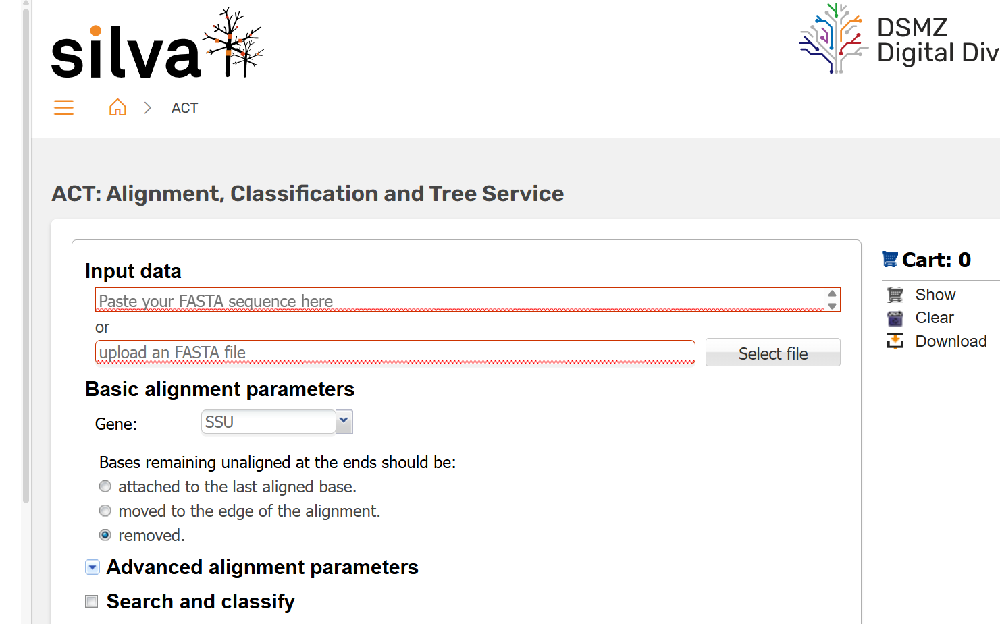

# Day 6: Comparative genomics
To determine the taxonomic position of the genome, we first extracted the 16S rRNA gene and compared its sequence with those available in the SILVA database. We then compared the genome with reference genomes of type strains by calculating digital DNA–DNA hybridization (dDDH) and average nucleotide identity (ANI) values.

##Extract 16S rRNA gene from the genome
* Count genes
```bash
grep -c "16S ribosomal RNA"
```
* Extract genes from the genome
```bash
seqkit grep -n -r -p "16S ribosomal RNA" bakta.ffn > 16S_gene.fasta
```
* 16S rRNA gene length
```bash
seqkit stat 16S_gene.fasta
```

## Alignment of the 16S rRNA gene with the closest phylogenetic neighbor identified in the SILVA database
```bash
sina -i 16S_gene.fasta -o aligned.fasta \
  --db SILVA_DATABASE.arb -p 4 \
  --turn all \
  --search \
  --lca-fields tax_slv,tax_ltp,tax_gtdb \
  --calc-idty \
  --meta-fmt csv
```
Alternatively, you can use the SILVA aligner webservice for sequences shorter than 1000bp
.


1. How many genes are present in the genome?
2. How many nucleotides does the 16S rRNA gene contain?
3. What is the closest phylogenetic neighbor identified in the SILVA database?
4. What is the percentage of 16S rRNA sequence identity with the closest phylogenetic neighbor?
5. Do the two organisms belong to the same genus?

### Calculate DNA–DNA hybridization (dDDH)
* Submit your genomes in https://ggdc.dsmz.de/ggdc.php
* Please remember to include your email address in the contact details. You will receive the results by email.
.

### Calcualte average nucleotide identity (ANI)
* Go to https://www.ezbiocloud.net/tools/ani 
* Upload your genome under “1. Genome sequence A” by clicking “Upload FASTA.”
* Upload the reference genome under “2. Genome sequence B” by clicking “Upload FASTA.”
* Click “Calculate.”
* Copy the ANI value and paste it into an Excel file.
* Repeat the same process with the other reference genomes.
.

Based on the ANI and dDDH values, does the genome represent a previously described species or a potentially novel species?
Does the genome represent a novel strain?


