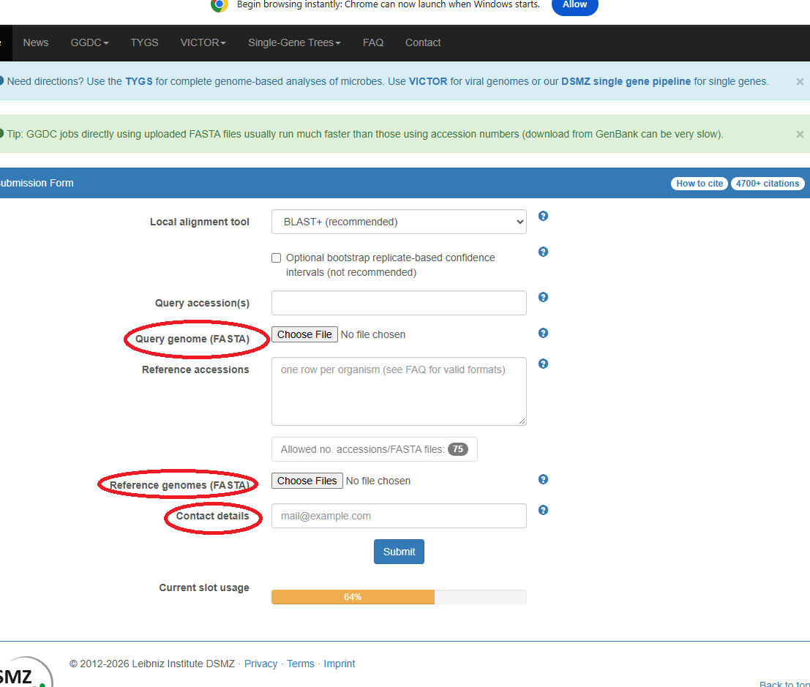
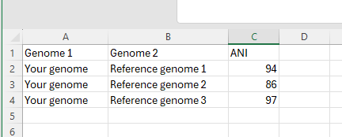

# Day 6: Comparative genomics
To determine the taxonomic position of the genome. We will compare it with reference genomes of type strains by calculating digital DNA–DNA hybridization (dDDH) and average nucleotide identity (ANI) values.

## Calculate DNA–DNA hybridization (dDDH)

* Submit your genomes in https://ggdc.dsmz.de/ggdc.php
* Please remember to include your email address in the contact details. You will receive the results by email.
.

## Calculate average nucleotide identity (ANI)

* Go to https://www.ezbiocloud.net/tools/ani 
* Upload your genome under “1. Genome sequence A” by clicking “Upload FASTA.”
* Upload the reference genome under “2. Genome sequence B” by clicking “Upload FASTA.”
* Click “Calculate.”
* Copy the ANI value and paste it into an Excel file.
* Repeat the same process with the other reference genomes.

.

Based on the ANI and dDDH values, does the genome represent a previously described species or a potentially novel species?
Does the genome represent a novel strain?
