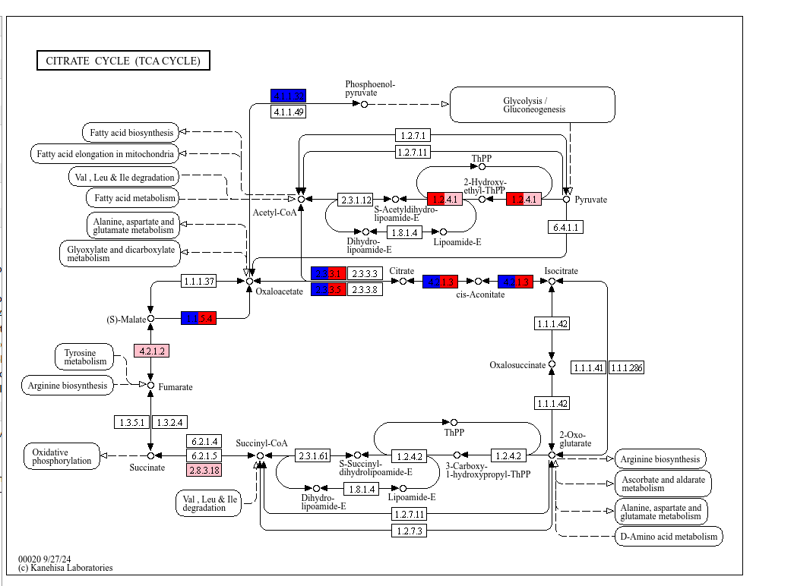
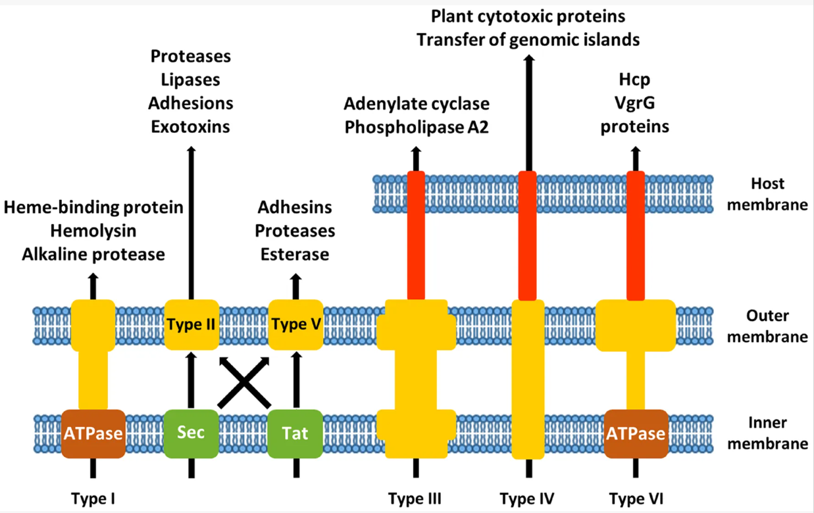

# Day 07: Genome annotation
We will compare the functional annotations of multiple genomes to identify differences in their functional profiles.


## KEGG-based functional analysis of multiple genomes
```bash
mkdir -p kegg_ids
grep -o "KEGG:K....." genome_1.gff3 | tr ":" "\t" > kegg_ids/genome_1_kegg_ids.txt 
grep -o "KEGG:K....." genome_2.gff3 | tr ":" "\t" > kegg_ids/genome_2_kegg_ids.txt
grep -o "KEGG:K....." genome_3.gff3 | tr ":" "\t" > kegg_ids/genome_3_kegg_ids.txt
```

Select column 1 with kegg id and add column 2 with colors
```bash
awk '{print $2 "\tblue"}' genome_1.gff3_kegg_ids.txt> kegg_ids/genome_1.gff3_kegg_ids_color.txt
awk '{print $2 "\tred"}' genome_2.gff3_kegg_ids.txt> kegg_ids/genome_2.gff3_kegg_ids_color.txt
awk '{print $2 "\tpink"}' genome_2.gff3_kegg_ids.txt> kegg_ids/genome_3.gff3_kegg_ids_color.txt
cat kegg_ids/genome_1.gff3_kegg_ids_color.txt kegg_ids/genome_2.gff3_kegg_ids_color.txt kegg_ids/genome_3.gff3_kegg_ids_color.txt > kegg_mapper_color.txt
```

submit file  `kegg_mapper_color.txt` to (https://www.genome.jp/kegg/mapper/color.html)



what are the main difference between your genome and the public genomes? 
Do they differ in main metabolism and secondary metabolism?

## MacSynfinder

Determine Bacterial scretion systems in your bacteria (https://github.com/gem-pasteur/macsyfinder)


```bash
mkdir -p macsyfinder
ls proteins_fasta/*.faa > files_list.txt
while IFS= read -r fasta; do
    sample=$(basename "$fasta" .faa)
    macsyfinder --db-type ordered_replicon \
  --sequence-db "$fasta" \
  --models-dir /home/julibote/TXSScan_model \
  --models TXSScan all \
  -o macsyfinder/"$sample"
done < files_list.txt
```
check file `macsyfinder/genome_1/best_solution_summary.tsv`

## Ecological inference
Can your isolate be found in other environments? Which environments? (https://branchwater.sourmash.bio/)
